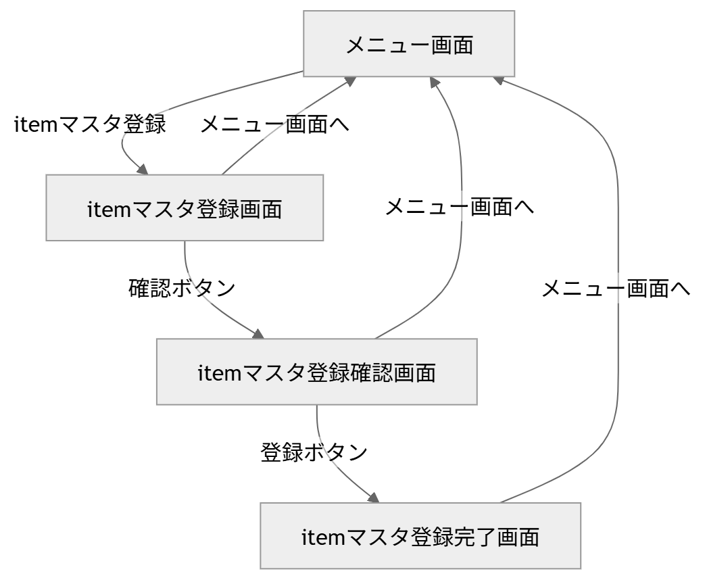

# spring-boot3-try

spring-bootでの簡単なアプリケーション開発

**やっていること**
このアプリでは以下の機能を実装しています。

- 商品一覧表示
- 商品登録
- 入力確認画面
- 登録完了画面

## ディレクトリ階層

ディレクトリ階層
```
C:.
│  .gitattributes
│  .gitignore
│  mvnw
│  mvnw.cmd
│  pom.xml
│  README.md
├─.mvn
│  └─wrapper
│          maven-wrapper.properties
└─src
    ├─main
    │  ├─java
    │  │  └─com
    │  │      └─example
    │  │          └─demo
    │  │              │  DemoApplication.java
    │  │              ├─entity
    │  │              │      Item.java
    │  │              │      ItemMapper.java
    │  │              └─web
    │  │                  ├─master
    │  │                  │  └─item
    │  │                  │          ItemForm.java
    │  │                  │          ItemRegistService.java
    │  │                  │          RegistController.java
    │  │                  └─menu
    │  │                          ItemFindService.java
    │  │                          MenuController.java
    │  └─resources
    │      │  application.properties
    │      │  data-all.sql
    │      │  schema-all.sql
    │      ├─static
    │      └─templates
    │          │  menu.html
    │          └─master
    │              └─item
    │                      complete.html
    │                      confirm.html
    │                      index.html
```

- 画面の遷移図



**画面遷移の流れ**

-このアプリは、メニュー画面で商品一覧を表示し、そこから itemマスタ登録画面 に進み、
入力 → 確認 → 登録完了 という流れで商品を登録する構成です

1. メニュー画面表示

処理の流れ
* ブラウザでアクセスする
* MenuControllerのmenuが呼ばれる
* ItemFindServiceのfindAllItems()が呼ばれる
* ItemMapperのfindAll()でitemテーブルから一覧取得する
* 取得した一覧をitemListとしてModelに格納する
* menu.htmlを返して画面表示する

2. itemマスタ登録画面（入力画面）へ遷移

処理の流れ
* メニュー画面のitemマスタ登録へリンクを押す
* /master/item/indexにアクセスする
* RegistControllerのindexが呼ばれる
* @ModelAttribute("form")ItemForm formでフォーム用オブジェクトを用意する
* master/item/indexを返して入力画面を表示する

3. 入力画面　→　確認画面

処理の流れ
* 入力画面でID・商品名・価格を入力する
* 「確認へ」を押す
* フォームの値がItemFormに詰められて送信される
* RegistControllerのconfirmが呼ばれる
* master/item/confirmを返して確認画面を表示する

4. 確認画面 → 登録処理実行

処理の流れ
* 確認画面で「登録」を押す
* RegistControllerのregistが呼ばれる
* form.toItem()でItemFormをItemに変換する
* ItemRegistServiceのregist(item)を呼ぶ
* ItemMapperのinsert(item)を実行してDB登録する
* 登録後、master/item/completeを返して確認画面を表示する

5. 登録完了画面表示

処理の流れ
* リダイレクトでmaster/item/completeにアクセスする
* RegistControllerのcompleteが呼ばれる
* master/item/completeを返して完了画面を表示する

**実行**
起動する
```
コマンドプロンプトで実行
mvnw.cmd spring-boot:run
```

## ブラウザアクセス
http://localhost:8080/

## 停止
```
起動中のコマンドプロンプトで、以下を実行
Ctrl + C
```